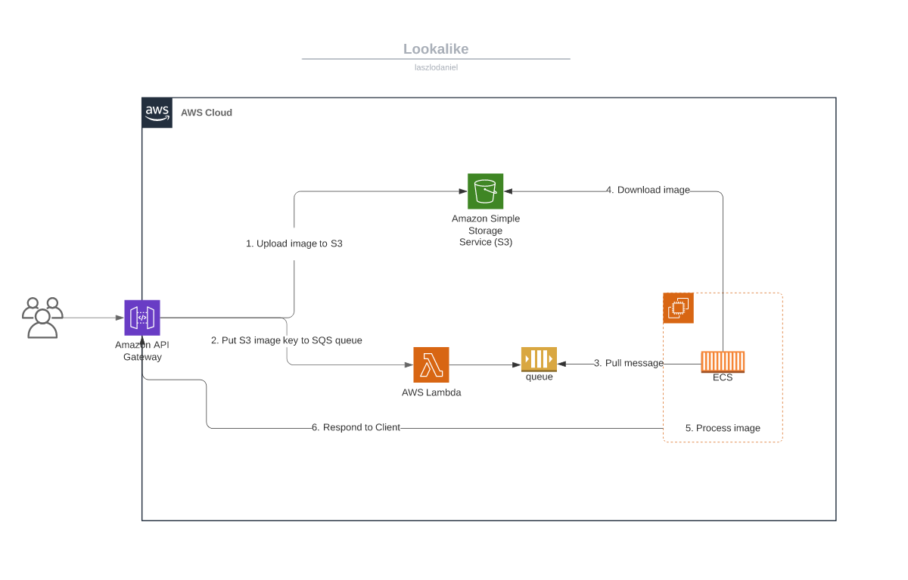

# lookalike

The project's primary goal is for me to practice my AWS skills.

But at some point it will be capable to also identify your celebrity lookalikes! :blush: http://lookalike.daniel-laszlo.me/

| NOTE: At this point the project can only identify the presidents of the 2020 election: Donald Trump and Joe Biden. |
| --- |

## Face recognition
I am using Adam Geitgey's face recognition project to find face matches: 
[ageitgey/face_recognition](https://github.com/ageitgey/face_recognition)

## TODO
- [ ] Use alternative method to upload photos to S3.
- [ ] Train an SVC classifier with multiple images per celebrity 
[as described here](https://github.com/ageitgey/face_recognition/blob/master/examples/face_recognition_svm.py).
- [ ] Develop decent website
- [ ] SSL certificate on website
- [ ] Use AWS CodePipeline

## Architecture

